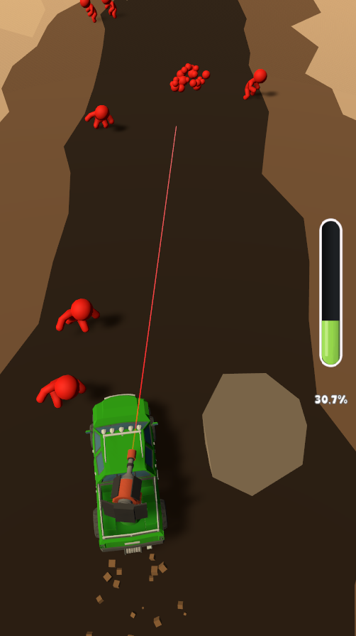

# Car Apocalypse

**A core gameplay prototype where the player controls a turret mounted on a moving vehicle, shooting down enemies while surviving to the end of the level.**  
This project was developed within 1 week

---

## Gameplay Overview

The player controls the rotation of a turret mounted on a car that moves forward automatically. Enemies are positioned along the track in idle state, and start running toward the car once it gets close. The goal is to **eliminate as many enemies as possible** while keeping the car alive until the end of the level.

**Gameplay flow:**
- The game starts with a static camera looking at the idle car.
- On screen tap: the car starts moving and the camera switches to a third-person follow view.
- If the car's HP reaches zero → `"You lose"` is shown.
- If the player finishes the level → `"You win"` is shown and the car stops.
- Another tap restarts the level from the beginning.

---

## Technologies & Architecture

The project follows **clean architecture principles** and emphasizes **scalability and maintainability** through modular code.

### Key Technologies:
- **Unity 2022.3.\*** LTS
- **Zenject** – Dependency Injection and modular bindings
- **UniTask** – Lightweight async operations
- **Multi-scene setup** – Separate `Gameplay`, `UI`, and `Environment` scenes
- **ScriptableObjects** – For configuration (vehicle, enemy, level)
- **Custom State Machine** – Game state management
- **Pooling System** – Bullets and enemy objects reuse
- **Event-driven architecture** – Using custom events and observer pattern
- **Camera system** – Dynamic transitions between static and follow view

---

### Gameplay Screenshots

